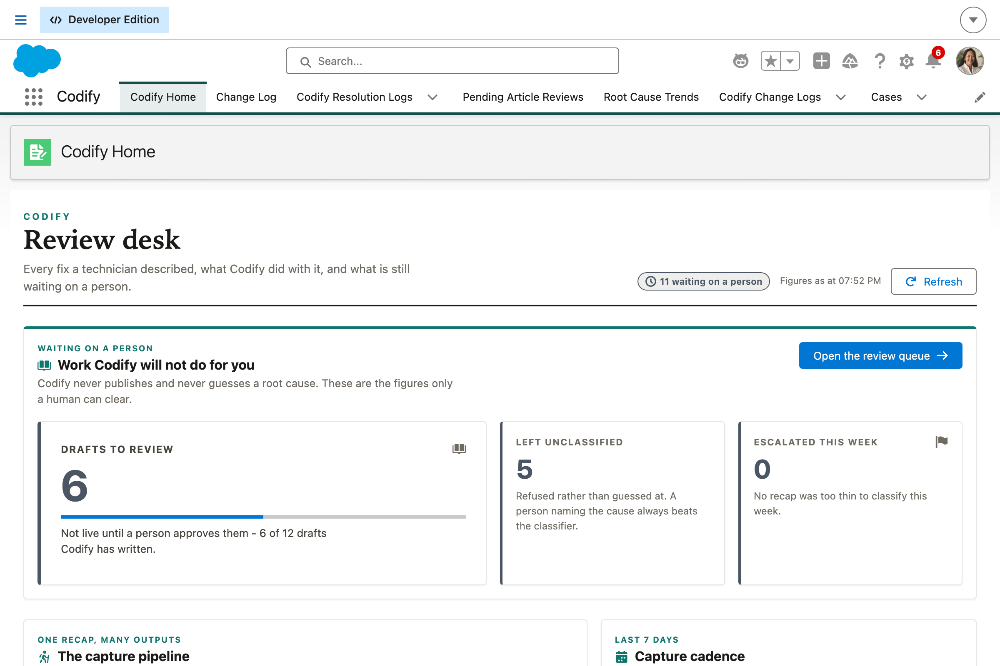
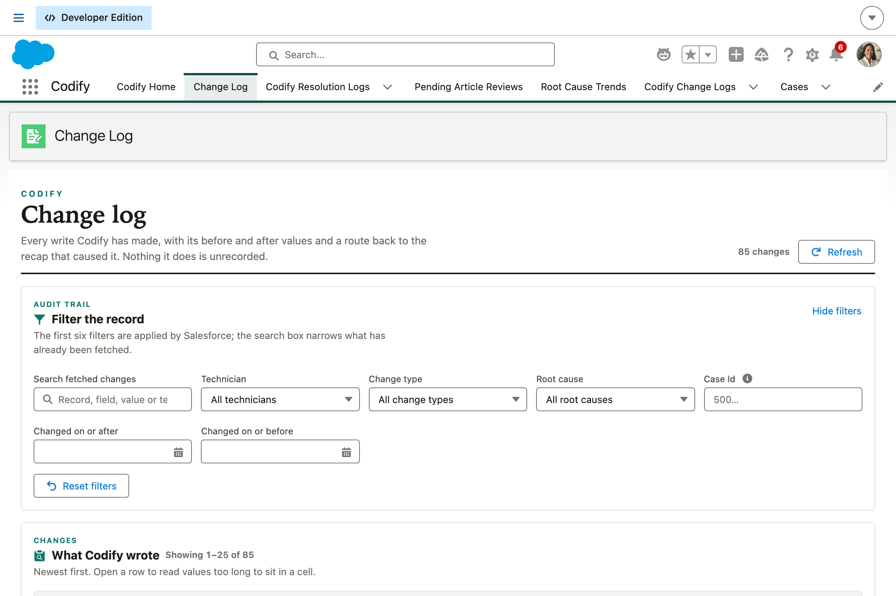
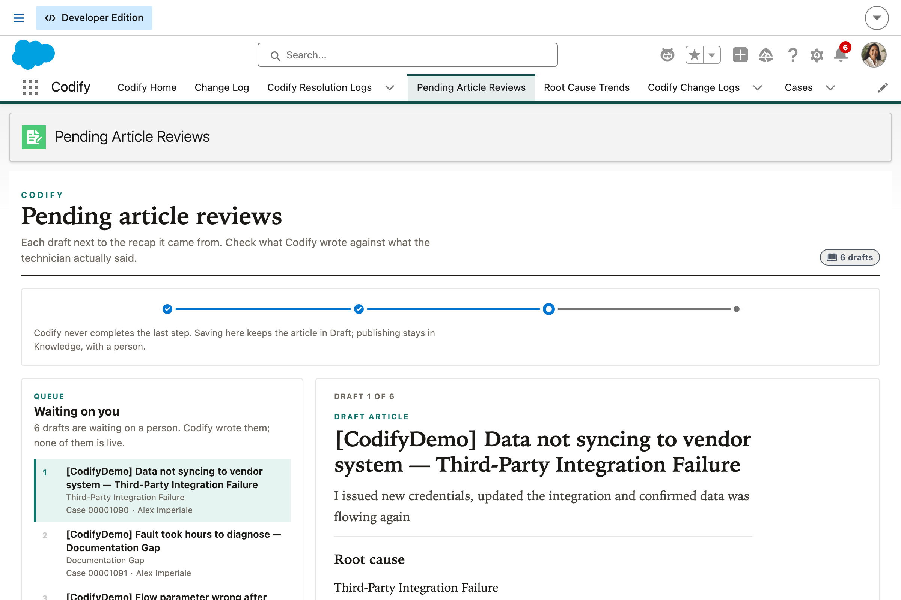
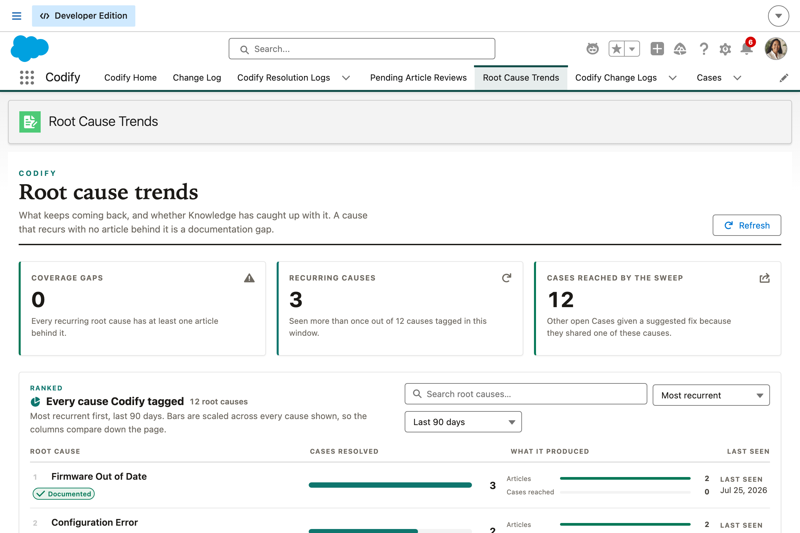

# Codify

**Codify is a service employee agent that captures how a Case was actually resolved and turns it into permanent, reusable knowledge.** After closing a Case, a service agent or field technician dictates or pastes a quick recap of the fix. Codify updates the Case's resolution fields, tags the root cause, and drafts a Knowledge article automatically, so the org's knowledge base grows from real fixes instead of depending on someone remembering to write documentation after the fact.

Codify runs inside Salesforce as an Agentforce employee agent, as the logged-in user. It is a sibling of [Scribe](../scribe), which does the same job for a sales rep's call recap.

Every write Codify makes, without exception, produces a **`Codify_Change_Log__c`** row, reviewable through its own Lightning app.

---

## Table of contents

- [The problem it solves](#the-problem-it-solves)
- [Design goals](#design-goals)
- [Architecture and data flow](#architecture-and-data-flow)
- [The five agent topics](#the-five-agent-topics)
- [How the classifier decides](#how-the-classifier-decides)
- [Data model](#data-model)
- [The Codify app](#the-codify-app)
- [Component inventory](#component-inventory)
- [Guardrails](#guardrails)
- [Install and deploy](#install-and-deploy)
- [Configuration reference](#configuration-reference)
- [Demo data](#demo-data)
- [Testing](#testing)
- [Project structure](#project-structure)
- [Status and known issues](#status-and-known-issues)
- [License](#license)

---

## The problem it solves

Knowledge bases go stale not because the knowledge doesn't exist, but because it exists only in the head of whoever solved the problem. The agent who diagnosed a tricky issue moves on to the next case, and the fix is never captured anywhere reusable. The next time the same issue comes in, someone else re-diagnoses it from scratch, or worse, a customer-facing self-service article never gets written at all because nobody has time to author one formally.

Codify's job is to make documentation a **byproduct of doing the work**, not a separate task someone has to remember afterward.

## Design goals

| Goal                            | How Codify honors it                                                                                                                                                                                                             |
| ------------------------------- | -------------------------------------------------------------------------------------------------------------------------------------------------------------------------------------------------------------------------------- |
| **Never invent a root cause**   | The classifier requires corroboration from **two distinct** taxonomy keywords before it will tag anything. A single passing mention of "network" is not a diagnosis. Below the floor it names what it was torn between and asks. |
| **Confirm before publishing**   | Case resolution updates apply directly, since they are internal record-keeping. Knowledge drafts **never** auto-publish, enforced structurally. See [Guardrails](#guardrails).                                                   |
| **One recap, multiple outputs** | The recap is parsed **once** and cached on `Codify_Resolution_Log__c.Extraction_JSON__c`. Every other topic reads that cache via the log id. No re-pasting, no inconsistent re-parsing.                                          |
| **Plain language**              | The agent's instructions ban Salesforce vocabulary outright. "I saved how you fixed it to the case", never "I updated the resolution field on the Case record".                                                                  |
| **Close the loop across Cases** | The Related Case Sweep flags other open Cases sharing the root cause, so one diagnosis helps clear a backlog instead of resolving one record.                                                                                    |
| **Full transparency**           | Every write funnels through `Codify_ChangeLogService` and produces an audit row with before/after values and a link back to the source recap.                                                                                    |

## Architecture and data flow

```
Technician talking to Codify in Agentforce
                     │  dictates or types one recap
                     ▼
        Codify_ExtractionService  ── one structured parse ──▶ cached on Codify_Resolution_Log__c
                     │
   ┌─────────────┬───┴─────────┬─────────────────┬──────────────────┐
   ▼             ▼             ▼                 ▼                  ▼
 Log         Tag root      Draft article    Related case      Escalate
 resolution  cause         (DRAFT only)     sweep             for review
 (direct)    (confident    (human review)   (needs confident  (safety valve)
             only)                           cause)
   │             │             │                 │                  │
   └─────────────┴─────────────┴─────────────────┴──────────────────┘
                     │
                     ▼
             Codify_Change_Log__c   ← every action writes exactly one audit row
```

## The five agent topics

| #   | Topic                       | Risk                  | What it does                                                                                                                                                                                    |
| --- | --------------------------- | --------------------- | ----------------------------------------------------------------------------------------------------------------------------------------------------------------------------------------------- |
| 1   | **Log Resolution**          | Direct write          | Extracts the resolution summary and root cause, writes both to the Case. Lower risk: it's the record already being closed, not a new customer-facing artifact.                                  |
| 2   | **Tag Root Cause**          | Direct write          | Classifies against the custom-metadata taxonomy. Usually runs inside Log Resolution; called separately when a technician corrects the cause, and a human naming it always beats the classifier. |
| 3   | **Draft Knowledge Article** | **Human review**      | Drafts into the org's template, always in `Draft`. Declines outright when the recap has a cause but no steps, because that makes an article nobody can follow.                                  |
| 4   | **Related Case Sweep**      | Writes to other Cases | Flags other open Cases with the same or a closely related cause. Writes a _suggestion_ field, never their resolution.                                                                           |
| 5   | **Escalate for Review**     | Safety valve          | When confidence is too low, creates a Task carrying the verbatim recap and the candidates it was torn between.                                                                                  |

## How the classifier decides

Scoring counts **distinct** keyword hits against each active taxonomy row, normalised against a saturation ceiling of three:

| Distinct keywords matched | Score | Result                           |
| ------------------------- | ----- | -------------------------------- |
| 1                         | 0.33  | **Below the 0.34 floor, no tag** |
| 2                         | 0.67  | Tagged                           |
| 3+                        | 1.00  | Tagged                           |

That asymmetry is the entire guardrail. One incidental word cannot tag a Case; corroboration is required. Counting _distinct_ keywords rather than occurrences means repeating one word in a rambling recap can't fake it.

Declining is a **designed outcome, not a failure**. A wrong root cause tag does not just mislabel one record, it misdirects the Related Case Sweep and pushes the wrong fix onto other people's open Cases. That is why the sweep re-checks confidence at the point of blast radius, not just at the point of classification.

## Data model

**`Codify_Resolution_Log__c`** holds the raw recap history: the verbatim recap (never rewritten, so a reviewer can always compare a draft against what was actually said), the extracted summary, the root cause and its confidence, whether a draft was produced, and the cached `Extraction_JSON__c` that makes "one recap, many outputs" true in code.

**`Codify_Change_Log__c`** is the audit backbone. One row per action, with `Change_Type__c`, `Related_Record_Id__c`, `Object_API_Name__c`, `Old_Value__c` / `New_Value__c`, `Requires_Human_Review__c`, and a lookup back to the resolution log so every change traces to the exact recap that produced it.

**`Codify_Root_Cause_Taxonomy__mdt`** defines the configurable root cause categories, with detection keywords, an article-worthiness flag, and related keys for the sweep. 14 rows ship covering hardware, software, configuration, process, environmental and user-error causes. Retire a cause by unchecking `Is_Active__c` rather than deleting it, so historical tags stay meaningful.

Plus custom fields on **Case** (resolution summary, root cause, suggested fix, resolved-via-Codify) and **Knowledge\_\_kav** (generated flag, article body, original recap, source Case and log).

## The Codify app

A Lightning app for service ops and Knowledge owners.

| Tab                         | Backed by                  | Shows                                                                                                    |
| --------------------------- | -------------------------- | -------------------------------------------------------------------------------------------------------- |
| **Codify Home**             | `codifyHomeDashboard`      | What is waiting on a person first, then the capture pipeline, cadence, what recurs, and the audit trail. |
| **Change Log**              | `codifyChangeLogConsole`   | Every change, filterable by technician, Case, root cause, type and date, with before/after values.       |
| **Resolution Logs**         | object tab                 | The raw recap history, linked forward to the Case and any article.                                       |
| **Pending Article Reviews** | `codifyArticleReviewPanel` | Drafts side by side with the recap that produced them. Edit or reject; publishing stays in Knowledge.    |
| **Root Cause Trends**       | `codifyRootCauseTrends`    | Which causes recur most, with a coverage column flagging recurring causes with no article behind them.   |

`codifyCaseHistoryBadge` is built for the Case record page: "Codify logged this resolution and drafted a Knowledge article", expandable, with click-through to the source recap. This repo does **not** ship a Case FlexiPage, because deploying one would replace whatever Case page the org already uses; drop the component onto the existing Case page in the Lightning App Builder instead.

**Record pages:** both custom objects a user can click into ship an assigned record page, since a Lightning page that exists but is not assigned is invisible.

| Object                     | Page                                | Reads as                                                                                                                                                                                                                                                    |
| -------------------------- | ----------------------------------- | ----------------------------------------------------------------------------------------------------------------------------------------------------------------------------------------------------------------------------------------------------------- |
| `Codify_Resolution_Log__c` | `Codify_Resolution_Log_Record_Page` | Diagnosis first (root cause, confidence, whether it fell below the floor, the Case), then the verbatim recap beside the extracted summary, then provenance and the cached parse. Related: every change this recap produced; sidebar: the Cases it resolved. |
| `Codify_Change_Log__c`     | `Codify_Change_Log_Record_Page`     | What changed, then old and new value side by side, with the source recap and technician in the sidebar. No related lists, because nothing looks up to an audit row.                                                                                         |

Assignment is an `actionOverrides` block on each object (`actionName` `View`, `type` `Flexipage`), which is what makes the page the org default rather than a page sitting unused in Setup. Neither object has activities or feeds enabled, so neither page carries an activity or Chatter region.

**Layouts:** related lists on a Lightning record page are drawn from the object's page layout, so each custom object ships its default layout (`<Object Label> Layout`, replaced in place so profile assignments survive) carrying the related list definitions and their columns.

**Compact layouts:** both objects assign one, so lookup hovers, search results and mobile show the root cause or the change type rather than just an autonumber.

**List views:** every object with a tab in this app ships an `All` view scoped to `Everything`, so no tab lands on a filtered subset - Cases, Knowledge, Resolution Logs and Change Logs. On top of that: Knowledge "Codify Drafts Pending Review" · Cases "Resolved via Codify" · Resolution Logs "This Week" and "By Root Cause" · Change Logs "This Week", "Awaiting Human Review", "Field Updates Only".

## Component inventory

**Apex (17 classes)** - `Codify_Constants`, `Codify_Util`, `Codify_ResolutionParse` (DTO), `Codify_ExtractionService` (the only place a recap is interpreted), `Codify_ChangeLogService` (the audit backbone); five invocables; three LWC controllers; `Codify_TestUtil` and three test classes.

**Flows (5, autolaunched)** - `Codify_Log_Resolution`, `Codify_Tag_Root_Cause`, `Codify_Draft_Knowledge_Article`, `Codify_Related_Case_Sweep`, `Codify_Escalate_For_Review`. Each wraps one invocable and maps its outputs for the agent.

**LWCs (13 bundles)** - five surfaces: `codifyHomeDashboard`, `codifyChangeLogConsole`, `codifyArticleReviewPanel`, `codifyRootCauseTrends`, `codifyCaseHistoryBadge`. Plus seven internal components no surface duplicates - `codifyKpiCard`, `codifySectionHeader`, `codifyStatusBadge`, `codifySkeletonLoader`, `codifyEmptyState`, `codifyErrorState`, `codifyRankedBars` - and `codifyDisplay`, a JS-only module holding change-type presentation and the one place Apex errors are turned into plain language. The seven are `isExposed=false`: they are the app's design system, not page builder components.

**Agent** - `Codify_Employee_Agent`, an `AiAuthoringBundle` of type `AgentforceEmployeeAgent`, with a router and six subagents. It runs as the logged-in user, so it needs no dedicated agent user.

**Permission sets** - `Codify_Agent_User` (no delete on the audit objects, no Knowledge publish right) and `Codify_Reviewer` (service ops and Knowledge owners; read-only on the change log).

## Guardrails

**Knowledge drafts never auto-publish.** This is enforced _structurally_, not conditionally. `Codify_DraftArticleInvocable` inserts a `Knowledge__kav`, which the platform creates in `Draft`, and never calls `KbManagement.PublishingService` anywhere. There is no flag, no input and no malformed agent response that can publish one, because there is no code path that publishes. The `forceDraft` input skips only the worthiness check, never review. `Codify_ArticleReviewController` deliberately omits a publish action for the same reason: adding one would turn a hard guardrail into a one-click bypass.

**Every write produces an audit row.** Not optional, not configurable.

**Case resolution updates apply directly.** They are internal record-keeping on the record being closed. Confirming every field would defeat the under-a-minute goal.

**Low confidence routes to a human.** Codify says so plainly and creates a Task rather than forcing a guess.

**The sweep only suggests.** It writes `Codify_Suggested_Fix__c` on other Cases and never their resolution fields. Those Cases belong to other people and have not been diagnosed.

## Install and deploy

**Prerequisites:** Salesforce Knowledge enabled with `Knowledge__kav`, and the running user flagged as a Knowledge User; Agentforce enabled.

```bash
git clone <this repo> && cd codify
sf org login web --alias codify-org
```

Deploy in dependency order, since `Codify_Resolution_Log__c` must exist before the objects that look up to it:

```bash
sf project deploy start -d force-app/main/default/objects/Codify_Resolution_Log__c -o codify-org
sf project deploy start -d force-app/main/default/objects -d force-app/main/default/customMetadata -o codify-org
sf project deploy start -d force-app/main/default/layouts -o codify-org
sf project deploy start -d force-app/main/default/classes -o codify-org
sf project deploy start -d force-app/main/default/flows -d force-app/main/default/lwc -o codify-org
sf project deploy start -d force-app/main/default/flexipages -o codify-org
sf project deploy start -d force-app/main/default/tabs -d force-app/main/default/applications -o codify-org
sf project deploy start -d force-app/main/default/permissionsets -o codify-org
sf project deploy start -d force-app/main/default/aiAuthoringBundles -o codify-org
```

> **One circular reference the staged order cannot express.** Each custom object's record page is assigned through an `actionOverrides` block in its own `*.object-meta.xml`, whose `content` names a FlexiPage - while that FlexiPage names the object's fields and related lists. Neither half validates without the other, so the two must land in the **same** deploy. Deploy the whole package at once instead of the two `objects` steps above if you are starting from an empty org:
>
> ```bash
> sf project deploy start -d force-app -o codify-org
> ```

Then assign access, publish and activate the agent:

```bash
sf org assign permset --name Codify_Agent_User --name Codify_Reviewer -o codify-org
sf agent publish authoring-bundle --api-name Codify_Employee_Agent -o codify-org
sf agent activate --api-name Codify_Employee_Agent -o codify-org
```

Nothing here needs an org-specific value filled in first.

## Configuration reference

**Tuning the taxonomy** - add or edit rows in `force-app/main/default/customMetadata/`. `Detection_Keywords__c` drives classification, `Article_Worthy__c` decides whether that kind of fix is normally worth writing up, `Related_Keys__c` widens the sweep. No Apex change needed.

**Tuning thresholds** - `Codify_Constants`:

| Constant                      | Default | Effect                                                             |
| ----------------------------- | ------- | ------------------------------------------------------------------ |
| `ROOT_CAUSE_CONFIDENCE_FLOOR` | `0.34`  | Below this, no tag. Raising it above 0.67 requires three keywords. |
| `MIN_RECAP_LENGTH`            | `25`    | Shorter recaps are rejected outright.                              |
| `MAX_SWEEP_CASES`             | `25`    | Caps how many Cases one fix can be suggested onto.                 |
| `ESCALATION_DUE_DAYS`         | `2`     | Due date on the escalation Task.                                   |

## Demo data

`scripts/apex/` drives the real invocables with twenty realistic recaps rather than inserting audit rows directly, so the dashboards show the system's actual behaviour and seeding doubles as an end-to-end exercise. Four recaps are deliberately vague, because the "waiting on a human" figures are only honest if some recaps genuinely failed to classify.

```bash
sf apex run --file scripts/apex/seed-demo-data.apex -o codify-org
sf apex run --file scripts/apex/seed-publish-articles.apex -o codify-org   # the human step
sf apex run --file scripts/apex/clear-demo-data.apex -o codify-org         # reset
```

`CreatedDate` is not writable, so every seeded record lands today and the 7-day trend shows a single column.

## Testing

```bash
sf apex run test -o codify-org -l RunLocalTests -w 20
npm run test:unit
npm run prettier:verify
npm run lint
```

The Apex suite covers the guardrails hardest: that an uncorroborated keyword does **not** tag, that the sweep refuses to run from a low-confidence diagnosis, that a forced draft still lands in `Draft`, that a second draft run does not duplicate, and that rejecting a draft keeps the resolution.

The Jest suite (109 tests across 13 bundles) covers the UI contracts that are easy to break by accident: that every surface shows a skeleton rather than a blank card while loading, that empty and error states are distinguishable from each other and from "nothing has happened yet", that state is never signalled by colour without a label, that rejecting a draft asks first, and that the review panel never grows a publish button.

> `npm run lint` uses the Salesforce template's `**/{aura,lwc}/**/*.js` glob and fails on this repo because there is no `aura` directory - a pre-existing quirk of the script, not of the code. `npx eslint force-app --ext js` runs clean.

## Project structure

```
codify/
├── force-app/main/default/
│   ├── aiAuthoringBundles/Codify_Employee_Agent/
│   ├── applications/ flexipages/ tabs/      # the Codify app surface
│   ├── classes/                             # 17 Apex classes
│   ├── customMetadata/                      # 14 root cause taxonomy rows
│   ├── flows/                               # 5 autolaunched flows
│   ├── layouts/                             # 2 default layouts, for the related lists
│   ├── lwc/                                 # 5 surfaces + 8 shared bundles
│   ├── objects/                             # 2 custom objects, 1 CMT, Case + Knowledge fields
│   └── permissionsets/
└── scripts/apex/                            # seed and reset
```

## Status and known issues

Deploy-verified and running: all components deploy clean, Apex tests **46/46 pass** at 94% coverage across the Codify classes, and an end-to-end run produced a tagged Case, a Knowledge draft, a suggestion on a sibling Case, and one audit row per action.

Four bugs that only a real deploy surfaced, all fixed here, each recorded because the error pointed nowhere near the cause:

1. **Custom metadata needs `xmlns:xsd` declared.** Every value uses `xsi:type="xsd:string"`; with the prefix undeclared the Metadata API rejects the deploy with a bare `UNKNOWN_EXCEPTION` and no component detail. A record with _no_ values validates cleanly, which is what makes it hard to spot. [Scribe](../scribe) has the same latent issue.
2. **Prettier corrupts `<flow>` elements.** `prettier-plugin-xml` hands their content to its JavaScript-Flow parser, which appends a stray `;` and reflows the value, silently breaking `flowAccesses`. `**/permissionsets/**` is excluded in `.prettierignore` and those files are formatted by hand.
3. **Agent Script needs a full locale.** `default_locale: "en"` is rejected by the compiler with a 422 that names no line or field; it must be `"en_US"`.
4. **Agent action outputs must match their Flow variable names exactly.** A Flow variable cannot be both an input and an output, so `Codify_Draft_Knowledge_Article` renames its output to `draftedArticleTitle`, and the agent must declare that name. The mismatch only surfaces on save, as a Generative AI Function Definition error.

## Screenshots

Captured from a live org at a 1200px viewport.

| | |
|---|---|
|  |  |
| **Codify Home.** The review desk. What is waiting on a person leads the page, because nothing else stalls without one. | **Change Log.** Every write, with before and after rendered as a diff. |
|  |  |
| **Pending Article Reviews.** The draft set as a manuscript, reviewer controls off the paper. | **Root Cause Trends.** Ranked causes with small multiples on shared scales. |

## License

See [LICENSE](LICENSE).
